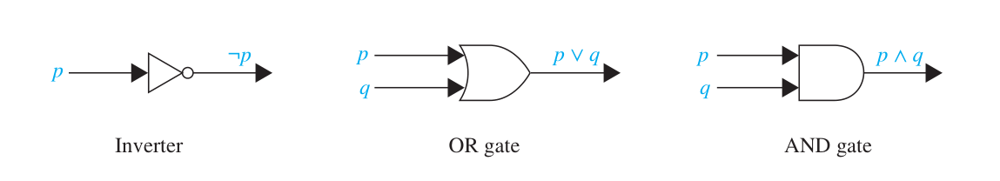

## Chapter 1. The Foundations: Logic and Proofs

[TOC]

$$
\def \T { \mathrm T }
\def \F { \mathrm F }
$$

Items *italic* and with an \* (an asterisk) are ones unimportant.

Items with an \* are ones not mentioned by teacher in the class.

Items with two \*s are ones mentioned by teacher but cannot be found on the Internet.

### Proposition

- A **proposition** is a declarative sentence that is either true or false, but not both.
- e.g.
  1. Beijing is the capital of China.
  2. $1 + 1 = 3$
  3. Is Beijing the capital of China?
  4. $x + 2 = 3$
  - 1 and 2 are propositions. Proposition 1 is true while 2 is false.
  - 3 is not a proposition since it is a question, not a declarative sentence.
  - 4 is not a proposition as it can be either true or false. However, it would become a proposition as we assign a value to $x$.
- We also need variables to denote propositions: **propositional variables**, or **sentential variables**.
- Typically we use letters $p, q, r, s, \ldots$ for propositional variables.
- For a proposition $p$, we can ask if $p$ is true or false. And it is called the **truth value** of $p$.
- Propositions that cannot be expressed in terms of simpler propositions are called **atomic propositions** (or **atomic formulas**, **atom** for short).
- We can use **connectives**, or called **logical operators**, to combine propositions into new propositions, called **compound propositions**.
- Above all, what we are studying is to deal with propositions, called **propositional calculus** or **propositional logic**.

### Logic Basis

- Describing the truth value of a compound proposition with all of the possible combinations of values can be annoying. We shall use a **truth table**.
- A proposition $p$ can be negated. The **negation** of $p$ is denoted by $\lnot p$ or $\bar p$, with a meaning of "not p". It has a truth table of
$$
\begin{array}{|c|c|} \hline
p & \lnot p \\ \hline
\T & \F \\ \hline
\F & \T \\ \hline
\end{array}
$$
- The **conjunction** of $p$ and $q$ is denoted by $p \land q$, with a meaning of "p and q".
  - Note that in logic the word "but" sometimes used instead of "and" in conjunction.
  - $p \land q$ is true if when both $p$ and $q$ are true and is false otherwise.
- The **disjunction** of $p$ and $q$ is denoted by $p \lor q$, with a meaning of "p or q".
  - The word "or" has two meanings in English. The disjunction corresponds to the **inclusive or**.
  - $p \lor q$ is true when at least one in $p$ and $q$ is true and is false otherwise.
- The truth table of conjunction and disjunction:
  $$
  \begin{array}{|c|c|c|c|} \hline
  p & q & p \land q & p \lor q \\ \hline
  \T & \T & \T & \T \\ \hline
  \T & \F & \F & \T \\ \hline
  \F & \T & \F & \T \\ \hline
  \F & \F & \F & \F \\ \hline
  \end{array}
  $$
  
### Extra Logical Operators
- The **exclusive or** of $p$ and $q$ is denoted by $p \oplus q$ (or $p \mathbin{ \mathrm{XOR}} q$ or $p \mathbin{\dot \lor} q$).
  - $p \oplus q$ is true when exactly one of $p$ and $q$ is true and is false otherwise.
- The **conditional statement** is denoted by $p \to q$, with a meaning of "if $p$ then $q$". It is also called **implication**.
  - In the conditional statement, $p$ is called the hypothesis (or antecedent or premise) and $q$ is called the conclusion (or consequence).
  - $p \to q$ is false when $p$ is true and $q$ is false. It is logically equivalent to $\lnot p \lor q$.
    - If two propositions always share the same truth values, regardless of the truth values of their propositional variables, we say that they are **equivalent**, or **logically equivalent**.
  - There are various ways to express conditional statement:
    
- The **biconditional statement** is denoted by $p \leftrightarrow q$, with a meaning of "$p$ if and only if $q$" ("$p$ iff $q$" for short).
  - $p \leftrightarrow q$ is true when $p$ and $q$ have the same truth values.
- The truth table:
$$
\begin{array}{|c|c|c|c|c|} \hline
p & q & p \oplus q & p \to q & p \leftrightarrow q \\ \hline
\T & \T & \F & \T & \T \\ \hline
\T & \F & \T & \F & \F \\ \hline
\F & \T & \T & \T & \F \\ \hline
\F & \F & \F & \T & \T \\ \hline
\end{array}
$$

### Based on Conditionals
- For a conditional proposition $p \to q$
  - $q \to p$ is called its **converse**.
  - $\lnot p \to \lnot q$ is called its **inverse**.
  - $\lnot q \to \lnot p$ is called its **contrapositive**.
- A conditional statement and its contrapositive are equivalent.
- The truth values of the converse and the inverse are not dependent on the original proposition. However, they are equivalent as they are contrapositives with each other.
  
### Precedence of Logical Operators

$$
\begin{array}{|c|c|} \hline
\text{Operator} & \text{Precedence} \\ \hline
\lnot & 1 \\ \hline
\land & 2 \\
\lor & 3 \\ \hline
\to & 4 \\
\leftrightarrow & 5 \\ \hline
\end{array}
$$
Note that the table does not contain exclusive or (operator $\oplus$). Actually there is not a general agreement on this problem. In practice, it is better to use parentheses or expand the exclusive or by definition to avoid ambiguity.

### *\*Bitwise Operations*
- A **bit** is a symbol with a value of either $\mathtt 0$ or $\mathtt 1$.
- Computer **bit operations** correspond to the logical connectives by replacing true by a $\mathtt 1$ and false by a $\mathtt 0$ in the truth table for the operators $\lor, \land$ and $\oplus$. We also use notation OR, AND and XOR respectively.
- Bit operations can be extend to bit strings. We define the bitwise OR, bitwise AND, and bitwise XOR of two bit strings of the same length to be the strings that have as their bits the OR, AND, and XOR of the corresponding bits in the two strings.
  
### *\*System Specifications*
- System and software engineers often need to translate natural language into precise and unambiguous specifications. Symbolic propositions are often used as **system specifications**.
- A set of system specifications is **consistent** iff it is possible to assign truth values to the proposition variables so that each proposition is true. (remember that "iff" is the contraction of "if and only if"?)
  
### *\*Boolean Search*
- When searching for something, **Boolean search** can be used to precisely locate the desired item. That is, using connectives AND, OR, and NOT to match or exclude particular items.
  
### *\*Logic Puzzles*
- Puzzles that can be solved using logical reasoning are called **logic puzzles**. Propositional logic can be used to solve them.
  
### Logic Circuits
- A **logic circuit** (or **digital circuit**) receives input signals and produces output signals by bits.
- Complicated digital circuits can be constructed from three basic **gates**: 
  - The **inverter**, or **NOT gate**, takes an input bit $p$, and produces as output $\lnot p$.
  - The **OR gate** takes two input signals $p$ and $q$, each a bit, and produces as output the signal $p \lor q$.
  - The **AND gate** takes two input signals $p$ and $q$, each a bit, and produces as output the signal $p \land q$.
- *The digital circuit can be many students' nightmare.*
  
### Propositional Equivalence
- A compound proposition that is always true is called a **tautology**. A compound proposition that is always false is called a **contradiction**. A compound proposition that is neither a tautology nor a contradiction is called a **contingency**.
- Propositions $p$ and $q$ are equivalent iff $p \leftrightarrow q$ is a tautology.
- The notations $p \equiv q$ and $p \Leftrightarrow q$ are used to denote that $p$ and $q$ are logically equivalent.
  
### Important Equivalences
- Some equivalences are important enough to have a name.
  $$
  \begin{gather}
    \begin{array}{|l|l|} \hline
      \text{Equivalence} & \text{Name} \\ \hline
      p \land \T \equiv p & \text{Identity laws} \\
      p \lor \F \equiv p & \\ \hline
      p \lor \T \equiv \T & \text{Domination laws} \\
      p \land \F \equiv \F & \\ \hline
      p \lor p \equiv p & \text{Idempotent laws} \\
      p \land p \equiv p & \\ \hline
      \lnot ( \lnot p) \equiv p & \text{Double negation law} \\ \hline
      p \lor q \equiv q \lor p & \text{Commutative laws} \\
      p \land q \equiv q \land p & \\ \hline
      (p \lor q) \lor r \equiv p \lor (q \lor r) & \text{Associative laws} \\
      (p \land q) \land r \equiv p \land (q \land r) & \\ \hline
      p \lor (q \land r) \equiv (p \lor q) \land (p \lor r) & \text{Distributive laws} \\
      p \land (q \lor r) \equiv (p \land q) \lor (p \land r) \\ \hline
      \lnot (p \land q) \equiv \lnot p \lor \lnot q & \text{De Morgan's laws} \\
      \lnot (p \lor q) \equiv \lnot p \land \lnot q & \\ \hline
      p \lor (p \land q) \equiv p & \text{Absorption laws} \\
      p \land (p \lor q) \equiv p & \\ \hline
      p \lor \lnot p \equiv \T & \text{Negation laws} \\
      p \land \lnot p \equiv \F \\ \hline
    \end{array} \\
    \begin{array}{|l|} \hline
      p \to q \equiv \lnot p \lor q \\
      p \to q \equiv \lnot q \to \lnot p \\
      p \lor q \equiv \lnot p \to q \\
      \lnot (p \to q) \equiv p \land \lnot q \\
      (p \to q) \land (p \to r) \equiv p \to (q \land r) \\
      (p \to r) \land (q \to r) \equiv (p \lor q) \to r \\
      (p \to q) \lor (p \to r) \equiv p \to (q \lor r) \\
      (p \to q) \lor (q \to r) \equiv (p \land q) \to r \\ \hline
    \end{array} \quad \begin{array}{|l|} \hline
      p \leftrightarrow q \equiv (p \to q) \land (q \to p) \\
      p \leftrightarrow q \equiv \lnot p \leftrightarrow \lnot q \\
      p \leftrightarrow q \equiv (p \land q) \lor ( \lnot p \land \lnot q) \\
      \lnot (p \leftrightarrow q) \equiv p \leftrightarrow \lnot q \\ \hline
    \end{array}
  \end{gather}
  $$
  
### Normal Forms of Compound Propositions
- An atom proposition or its negation is called a **\*literal**.
- A disjunction of literals is called a **\*clause** (or simply a "disjunction").
- A conjunction of literals is called a **\*term** (or simply a "conjunction").
- A disjunction of terms, namely **an $\lor$ of $\land$s**, is called a **disjunctive normal form** (or **DNF** for short).
- A conjunction of clauses, namely **an $\land$ of $\lor$​s**, is called a **conjunctive normal form** (or **CNF** for short).
- A clause contains all variables is called a **\*\*maxterm**.
- A term contains all variables is called a **\*\*minterm**.
- For a DNF, if its every term is a minterm, the DNF is called a **\*\*major DNF** (or **\*\*principal DNF** or **\*full DNF** or **\*canonical DNF**).
- For a CNF, if its every clause is a maxterm, the CNF is called a **\*\*major CNF** (or **\*\*principal CNF** or **\*full CNF** or **\*canonical CNF**).
- Theorem: Any proposition can be converted into at least a DNF or at least a CNF.
- Theorem: Any proposition can be converted into a unique DNF or a unique CNF.
- Methods to convert a proposition into a major DNF
  - Using a truth table:
    1. Write the truth table of the proposition.
    2. Take a disjunction of all satisfying truth assignments.
  - Using propositional equivalence
    1. Eliminate implication signs.
    2. Moving negation inwards and eliminate double negation.
    3. Convert to DNF using associative and distributive laws.
    4. If there is a term $P$ that is not a minterm and misses proposition variable $p$, replace it with $(p \land \lnot p) \lor P$.
    5. Expand the new term using distributive law.
    6. Repeat steps 4 and 5 until there are no more terms that are not minterms. Merge the same minterm, and we finally get the major DNF.
- Methods to convert a proposition into a major CNF
  - Using a truth table:
    1. Write the truth table of the proposition.
    2. Take a conjunction of all falsifying truth assignments.
  - Using propositional equivalence
    1. Eliminate implication signs.
    2. Moving negation inwards and eliminate double negation.
    3. Convert to CNF using associative and distributive laws.
    4. If there is a clause $P$ that is not a maxterm and misses proposition variable $p$, replace it with $(p \lor \lnot p) \land P$.
    5. Expand the new clause using distributive law.
    6. Repeat steps 4 and 5 until there are no more clauses that are not maxterms. Merge the same maxterm, and we finally get the major CNF.
- The methods to convert a proposition into a major normal form ("major NF" below) are tedious and fallible. There would be better an example to present how to use the methods. But I'm lazy and tired.
- The major NF we get can sometimes grow very big. In fact, if there are $n$ propositional variables, the number of minterms or maxterms in the major NF can up to $2^n$​.

### Satisfiability of a Proposition

- A proposition is **satisfiable** if there is an assignment of truth values to its variables that makes it true. Otherwise it is **unsatisfiable**. Such an assignment to make it true is called a **solution**.
- A proposition is satisfiable iff it is a tautology or a contingency.
- The Satisfiability of a proposition can be used to solve problems such as **The n-Queens Problem** or **Sudoku**.

## Appendix: Glossary

English terms with an \* are ones not mentioned by teacher and textbook. (their translation can be mentioned or not)

Translations or terms with two \*s are ones mentioned by teacher but cannot be found on the Internet.

| terms in English                             | 中文译名                   |
| :------------------------------------------- | -------------------------- |
| proposition                                  | 命题                       |
| propositional variable / sentential variable | 命题变量                   |
| truth value                                  | 真值                       |
| atomic proposition / *atomic formula (atom)  | 原子命题 / 原子公式        |
| connectives / logic operator                 | 逻辑运算（符）             |
| compound proposition                         | 复合命题                   |
| propositional calculus / propositional logic | 命题演算 / 命题逻辑        |
| truth table                                  | 真值表                     |
| negation                                     | 否定                       |
| conjunction                                  | 合取                       |
| disjunction                                  | 析取                       |
| inclusive or                                 | 或 / 包含或                |
| exclusive or                                 | 异或 / 互斥或              |
| conditional statement                        | 条件语句                   |
| implication                                  | 蕴含                       |
| logically equivalent                         | 逻辑等价                   |
| equivalent                                   | 等价                       |
| biconditional                                |                            |
| converse                                     | 逆命题                     |
| inverse                                      | 否命题                     |
| contrapositive                               | 逆否命题                   |
| bit                                          | 位                         |
| bit operation                                | 位运算                     |
| system specifications                        |                            |
| consistent                                   |                            |
| Boolean search                               |                            |
| inverter                                     |                            |
| gate                                         | 门                         |
| NOT gate                                     | 非门                       |
| OR gate                                      | 或门                       |
| AND gate                                     | 与门                       |
| tautology                                    | 重言式 / 永真式            |
| contradiction                                |                            |
| contingency                                  |                            |
| \*literal                                    | 字面量                     |
| \*clause                                     | 子句 / 简单析取式 / 基本和 |
| \*term                                       | 短语 / 简单合取式 / 基本积 |
| disjunctive normal form (DNF)                | 析取范式                   |
| conjunctive normal form (CNF)                | 合取范式                   |
| \*\*minterm                                  | 最小项                     |
| \*\*maxterm                                  | 最大项                     |
| \*\*major DNF / \*\*principal DNF            | 主析取范式                 |
| \*full DNF / \*canonical DNF                 | 主析取范式                 |
| \*\*major CNF / \*\*principal CNF            | 主合取范式                 |
| \*full CNF / \*canonical CNF                 | 主合取范式                 |
| satisfiable                                  | 可满足                     |
| unsatisfiable                                | 不可满足                   |
| solution                                     | 解                         |
| The n-Queens Problem                         | n 皇后问题                 |
| Sudoku                                       | 数独                       |
