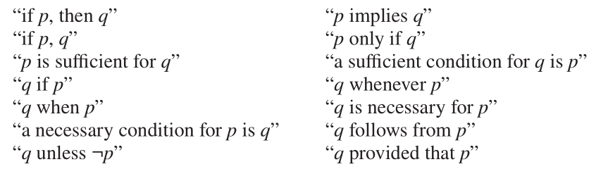
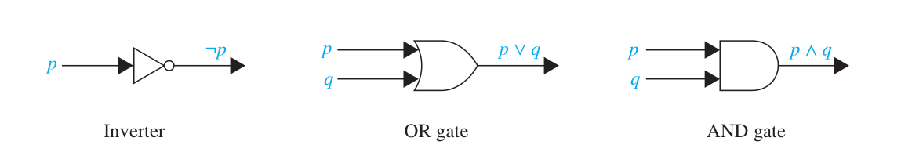

## Chapter 1. The Foundations: Logic and Proofs

[TOC]

$$
\def \T { \mathrm T }
\def \F { \mathrm F }
$$

###格式说明：
_斜体_ 并带 \* 号为非重要内容

带 \* 为老师上课没讲的内容

带 \*\* 号的内容为老师上课讲了但网上没有的内容

### 命题(Proposition)

**命题** 是一个陈述句，或真或假，**但不能亦真亦假**

- 例如
  1. 北京是中国的首都。
  2. $1 + 1 = 3$
  3. 北京市中国的首都吗？
  4. $x + 2 = 3$
  - 1 和 2 是命题。命题 1 为真，命题 2 为假。
  - 3 不是命题，这是疑问句。
  - 4 不是命题，因为其真值未确定。但为 $x$ 赋值后他就会变成一个命题。
- **命题变元**用来表征命题(**propositional variables**, or **sentential variables**)，例如 p，q，r，s……
- **真值（truth table）**：表明命题的真假。
- **原子命题（atomic propositions \ atomtic formulas \ atom )**：使用最简单的表达方法的命题，使用**逻辑运算符（connectives \ logical operatoers)**连接而成**复合命题（compound propositions)**。
- **逻辑运算（propositional calculus \ propositional logic**).

### 基础逻辑(Logic Basis)

- **真值表（truth table）**：用来表示一个命题的**所有**可能性。
- **非（negation）** $p$ ($\lnot p$ or $\bar p$)
  $$
  \begin{array}{|c|c|} \hline
  p & \lnot p \\ \hline
  \T & \F \\ \hline
  \F & \T \\ \hline
  \end{array}
  $$
- **合取（conjunction）**$p \land q$
  - 注意但是（but）有时会代替和（and）使用。
- **析取（disjunction）**$p \lor q$
  - 或指代的是**包含或关系（inclusive or）**
  - 至少有一个为真，两个也行。
    $$
    \begin{array}{|c|c|c|c|} \hline
    p & q & p \land q & p \lor q \\ \hline
    \T & \T & \T & \T \\ \hline
    \T & \F & \F & \T \\ \hline
    \F & \T & \F & \T \\ \hline
    \F & \F & \F & \F \\ \hline
    \end{array}
    $$

### 其他逻辑运算符（Extra Logical Operators）

- **抑或（exclusive or）** $p \oplus q$ (or $p \mathbin{ \mathrm{XOR}} q$ or $p \mathbin{\dot \lor} q$).
  - $p \oplus q$为**真当且仅当**其中有一个为真，另有一个为假
- **条件语句（蕴含）（conditional statement \ implication）** $p \to q$，表示如果 $p$ 则 $q$
  - $p$ 表示**假设(前件)(hypothesis \ antecedent or premise)** ,$q$ 表示**结论（后件） (conclusion or consequence)**.
  - $p \to q$ 为假当且仅当 $p$ 为真 $q$ 为假。等价于 $\lnot p \lor q$。
  - **命题等价（equivalent \ logically equivalent）**.
    - 两个命题总是有相同的真值，无论他们的命题变元的真假。
  - 条件语句的表示方法:
    
- **等价命题（biconditional statement）** $p \leftrightarrow q$ 表示 "$p$ 当且仅当 $q$" (简写为 "$p$ iff $q$" )。
  - $p \leftrightarrow q$ 为真，当$p$ $q$ 有相同的真值。
    $$
    \begin{array}{|c|c|c|c|c|} \hline
    p & q & p \oplus q & p \to q & p \leftrightarrow q \\ \hline
    \T & \T & \F & \T & \T \\ \hline
    \T & \F & \T & \F & \F \\ \hline
    \F & \T & \T & \T & \F \\ \hline
    \F & \F & \F & \T & \T \\ \hline
    \end{array}
    $$

### 衍生 Based on Conditionals

- 对于 $p \to q$
  - $q \to p$ 表示 **逆命题 converse**
  - $\lnot p \to \lnot q$ 表示 **否命题 inverse**
  - $\lnot q \to \lnot p$ 表示 **逆否命题 contrapositive**
- 逆否命题与原命题等价，但逆命题和否命题于原命题真值无关系

### 逻辑运算符的优先级 Precedence of Logical Operators

$$
\begin{array}{|c|c|} \hline
\text{运算符} & \text{优先级} \\ \hline
\lnot & 1 \\ \hline
\land & 2 \\
\lor & 3 \\ \hline
\to & 4 \\
\leftrightarrow & 5 \\ \hline
\end{array}
$$

注意到表格不包含异或（$\oplus$），建议在做题中不要使用异或。

### _\*按位操作符 Bitwise Operations_

- **位（bit）** 由 $\mathtt 0$ 表示假 $\mathtt 1$ 表示真
- 对字符串使用按位运算是指将两个相同长度的字符串逐位的进行位运算操作，位运算符的真值表是由逻辑运算符将真替换为 1，假替换为 0 得到。

### _\*系统规范 System Specifications_

- **系统规范（system specifications）**通常被用于将自然语言转化为准确无歧义的表达。通常使用**符号命题（symbolic proposition）**来表示。
- 一组系统规范是**自洽的（consistent）** 当且仅当存在至少一种命题变元的**指派（assignment）**使得所有的条件都为真。

### _\*布尔搜索 Boolean Search_

- 使用 AND, OR, and NOT 来匹配或者排除。

### _\*逻辑谜题 Logic Puzzles_

- Puzzles that can be solved using logical reasoning are called **logic puzzles**. Propositional logic can be used to solve them.

### 数字电路 Logic Circuits

- **数字电路\*（logic circuit \ digital circuit)**用二进制数字输入输出。
- 复杂的数字电路由三种基本的**门电路（gates）**组成: 
  - **非门（inverter \ NOT gate）** 输入 $p$ 输出 $\lnot p$.
  - **或门（OR gate）** 输入 $p$ $q$ 输出 $p \lor q$.
  - **与门（AND gate）** 输入 $p$ $q$输出$p \land q$.

### 命题等价 Propositional Equivalence

- 命题公式分为：**永真式 （tautology）**：命题永远为真值。**永假式（contradiction）**：命题永远为假。 **可满足式（contingency）**：既不永真，也不永假。
- $p$ $q$ 等价当且仅当 $p \leftrightarrow q$ 为永真式。用 $p \equiv q$ $p \Leftrightarrow q$表示。
- 等价证明方法
  - 真值表
  - 公式推导
    证伪：找到反例（counter example）

### 重要等价 Important Equivalences

- 这些只是一种**等价模式**其中的命题变元可以用任何公式替代。

$$
\begin{gather}
  \begin{array}{|l|l|} \hline
    \text{Equivalence} & \text{Name} \\ \hline
    p \land \T \equiv p & \text{Identity laws} \\
    p \lor \F \equiv p & \\ \hline
    p \lor \T \equiv \T & \text{Domination laws} \\
    p \land \F \equiv \F & \\ \hline
    p \lor p \equiv p & \text{Idempotent laws} \\
    p \land p \equiv p & \\ \hline
    \lnot ( \lnot p) \equiv p & \text{Double negation law} \\ \hline
    p \lor q \equiv q \lor p & \text{Commutative laws} \\
    p \land q \equiv q \land p & \\ \hline
    (p \lor q) \lor r \equiv p \lor (q \lor r) & \text{Associative laws} \\
    (p \land q) \land r \equiv p \land (q \land r) & \\ \hline
    p \lor (q \land r) \equiv (p \lor q) \land (p \lor r) & \text{!!Distributive laws!!} \\
    p \land (q \lor r) \equiv (p \land q) \lor (p \land r) \\ \hline
    \lnot (p \land q) \equiv \lnot p \lor \lnot q & \text{!!De Morgan's laws!!} \\
    \lnot (p \lor q) \equiv \lnot p \land \lnot q & \\ \hline
    p \lor (p \land q) \equiv p & \text{Absorption laws} \\
    p \land (p \lor q) \equiv p & \\ \hline
    p \lor \lnot p \equiv \T & \text{Negation laws} \\
    p \land \lnot p \equiv \F \\ \hline
  \end{array} \\
  \begin{array}{|l|} \hline
    !!p \to q \equiv \lnot p \lor q !!\\
    p \to q \equiv \lnot q \to \lnot p \\
    p \lor q \equiv \lnot p \to q \\
    \lnot (p \to q) \equiv p \land \lnot q \\
    (p \to q) \land (p \to r) \equiv p \to (q \land r) \\
    (p \to r) \land (q \to r) \equiv (p \lor q) \to r \\
    (p \to q) \lor (p \to r) \equiv p \to (q \lor r) \\
    (p \to q) \lor (q \to r) \equiv (p \land q) \to r \\ \hline
  \end{array} \quad \begin{array}{|l|} \hline
    p \leftrightarrow q \equiv (p \to q) \land (q \to p) \\
    p \leftrightarrow q \equiv \lnot p \leftrightarrow \lnot q \\
    p \leftrightarrow q \equiv (p \land q) \lor ( \lnot p \land \lnot q) \\
    \lnot (p \leftrightarrow q) \equiv p \leftrightarrow \lnot q \\ \hline
  \end{array}
\end{gather}
$$

### 复合命题的常见形式 Normal Forms of Compound Propositions

- **简单析取式（基本和）\*clause** :仅由命题变元**或**其否定析取而成。
- **简单合取式（基本积）\*term**：仅由命题变元或其否定合取而成。
- **析取范式（disjunctive normal form \ DNF）** 由有限个简单合取式析取而成。
- **合取范式 （conjunctive normal form \ CNF）** 由有限个简单析取式合取而成。
- **极大项（布尔析取）（\*\*maxterm）**：每个命题变项或其否定两者出现，且只能出现一个，将变项按照字典序排列。
- **极小项（布尔合取）（\*\*minterm）**：每个命题变项或其否定两者出现，且只能出现一个，将变项按照字典序排列。
- 极小项与赋值一一对应，每一个极小项只有一组赋值使其为真，命题变项用 01 替换后转化为十进制，作为极小项 M 的下标。
- **主析取范式（\*\*major DNF \ \*\*principal DNF \ \*full DNF \ \*canonical DNF）**：若干不同极小项的析取。
- **主合取范式（\*\*major CNF \*\*principal CNF \*full CNF \*canonical CNF）**:若干极大项的合取。
- 任何一个命题都存在且唯一存在与之对应的主合取范式和主析取范式 。
- - Using a truth table:
    1. Write the truth table of the proposition.
    2. Take a disjunction of all satisfying truth assignments.
  - Using propositional equivalence
    1. Eliminate implication signs.
    2. Moving negation inwards and eliminate double negation.
    3. Convert to DNF using associative and distributive laws.
    4. If there is a term $P$ that is not a minterm and misses proposition variable $p$, replace it with $(p \land \lnot p) \lor P$.
    5. Expand the new term using distributive law.
    6. Repeat steps 4 and 5 until there are no more terms that are not minterms. Merge the same minterm, and we finally get the major DNF.
- Methods to convert a proposition into a major CNF
  - Using a truth table:
    1. Write the truth table of the proposition.
    2. Take a conjunction of all falsifying truth assignments.
  - Using propositional equivalence
    1. Eliminate implication signs.
    2. Moving negation inwards and eliminate double negation.
    3. Convert to CNF using associative and distributive laws.
    4. If there is a clause $P$ that is not a maxterm and misses proposition variable $p$, replace it with $(p \lor \lnot p) \land P$.
    5. Expand the new clause using distributive law.
    6. Repeat steps 4 and 5 until there are no more clauses that are not maxterms. Merge the same maxterm, and we finally get the major CNF.
- The methods to convert a proposition into a major normal form ("major NF" below) are tedious and fallible. There would be better an example to present how to use the methods. But I'm lazy and tired.
- The major NF we get can sometimes grow very big. In fact, if there are $n$ propositional variables, the number of minterms or maxterms in the major NF can up to $2^n$​.

### 命题的可满足性 Satisfiability of a Proposition

- 命题是 **可满足的（satisfiable）** 当且仅当有至少一组指派使得命题为真，否则命题是**不可满足的（unsatisfiable）**，这组指派称为命题的**解（solution）**。

## 中英文对照

带\*的英文是老师或者教材未曾提到的。
带\*\* 的英文是老师提到过但网络上找不到的。

| terms in English                             | 中文译名                   |
| :------------------------------------------- | -------------------------- |
| proposition                                  | 命题                       |
| propositional variable / sentential variable | 命题变量                   |
| truth value                                  | 真值                       |
| atomic proposition / \*atomic formula (atom) | 原子命题 / 原子公式        |
| connectives / logic operator                 | 逻辑运算（符）             |
| compound proposition                         | 复合命题                   |
| propositional calculus / propositional logic | 命题演算 / 命题逻辑        |
| truth table                                  | 真值表                     |
| negation                                     | 否定                       |
| conjunction                                  | 合取                       |
| disjunction                                  | 析取                       |
| inclusive or                                 | 或 / 包含或                |
| exclusive or                                 | 异或 / 互斥或              |
| conditional statement                        | 条件语句                   |
| implication                                  | 蕴含                       |
| logically equivalent                         | 逻辑等价                   |
| equivalent                                   | 等价                       |
| biconditional                                |                            |
| converse                                     | 逆命题                     |
| inverse                                      | 否命题                     |
| contrapositive                               | 逆否命题                   |
| bit                                          | 位                         |
| bit operation                                | 位运算                     |
| system specifications                        |                            |
| consistent                                   |                            |
| Boolean search                               |                            |
| inverter                                     |                            |
| gate                                         | 门                         |
| NOT gate                                     | 非门                       |
| OR gate                                      | 或门                       |
| AND gate                                     | 与门                       |
| tautology                                    | 重言式 / 永真式            |
| contradiction                                |                            |
| contingency                                  |                            |
| \*literal                                    | 字面量                     |
| \*clause                                     | 子句 / 简单析取式 / 基本和 |
| \*term                                       | 短语 / 简单合取式 / 基本积 |
| disjunctive normal form (DNF)                | 析取范式                   |
| conjunctive normal form (CNF)                | 合取范式                   |
| \*\*minterm                                  | 最小项                     |
| \*\*maxterm                                  | 最大项                     |
| \*\*major DNF / \*\*principal DNF            | 主析取范式                 |
| \*full DNF / \*canonical DNF                 | 主析取范式                 |
| \*\*major CNF / \*\*principal CNF            | 主合取范式                 |
| \*full CNF / \*canonical CNF                 | 主合取范式                 |
| satisfiable                                  | 可满足                     |
| unsatisfiable                                | 不可满足                   |
| solution                                     | 解                         |
| The n-Queens Problem                         | n 皇后问题                 |
| Sudoku                                       | 数独                       |
